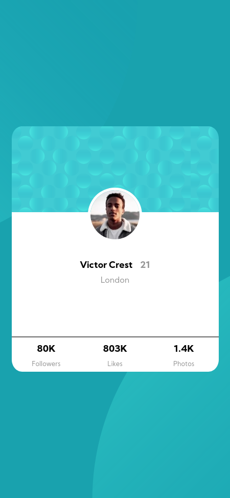
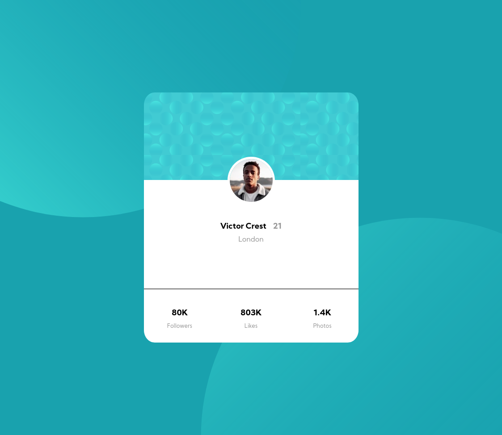

# Frontend Mentor - Profile card component

## Overview

My attempt to recreate the profile card, with responsive design

## Process

- [x] Setup project structure
- [x] Write the HTML markup with proper sematics
- [x] Css for mobile device
- [x] Css for desktop

## Screenshot

## Links

- [Example hosted on netlify](https://profile-card-component-frontend.netlify.app/)

### Useful resources

- [The challenge on frontendmontor.io](https://www.frontendmentor.io/challenges/profile-card-component-cfArpWshJ)